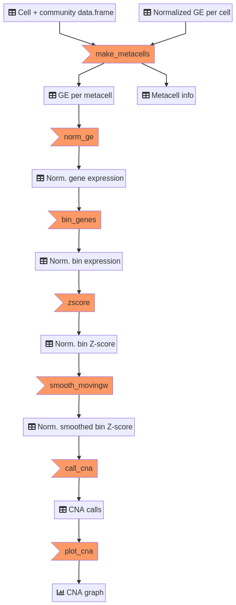

# scCNAutils
Functions to analyze copy number aberrations in single-cell data

## Install

```r
devtools::install_github('jmonlong/scCNAutils')
```

## Usage

```r
library(scCNAutils)
res.df = auto_cna_signal(c('sampleA', 'sampleB'), 'genes.tsv', prefix='example', cell_cycle='cc_genes.tsv')
load('example-coord-norm.RData')
cna.df = auto_cna_call(data, res.df, prefix='example')
```

where 

- *sampleA* and *sampleB* are folders with *matrix.mtx*, *genes.tsv* and *barcodes.tsv* files.
- *genes.tsv* has coordinates for each genes. Columns: *chr*, *start*, *end*, *symbol*.
- *cc_genes.tsv* has a list of genes for *G1.S*/*G2.M* cell-cycle phases. Columns: *symbol*, *phase*.

## Workflow

### From gene expression to CNA signal

The `auto_cna_signal` function calls the appropriate functions to go from raw expression to communities and tSNE based on CNA signal.
The internal workflow is as follow:


### From communities to CNA

The `auto_cna_call` function creates metacells per community and call CNAs.
The internal workflow is as follow:




## Next

- Restart feature.
- Try to use Seurat's functions (e.g. Louvain with gamma and UMAP).
- Example on public cancer data.
